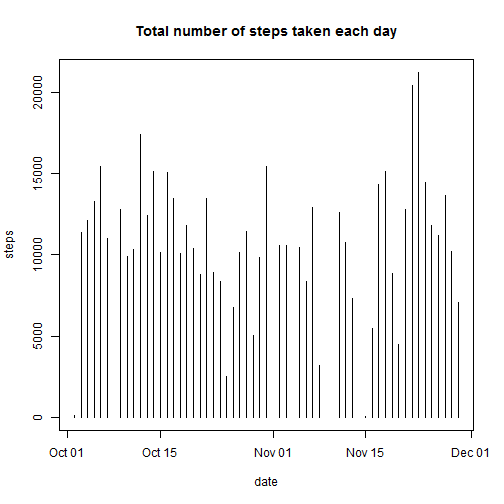
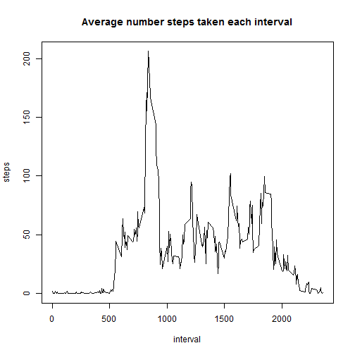
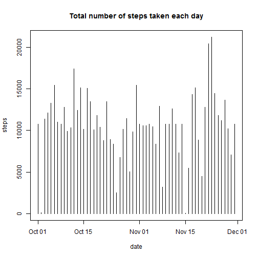
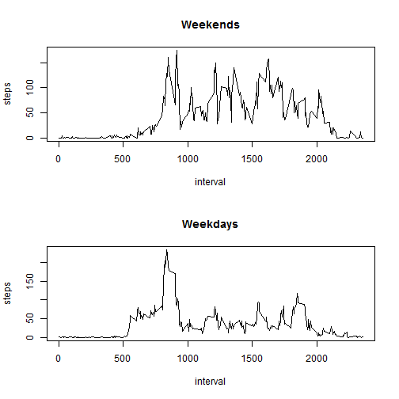

##Loading and preprocessing the data

First we load the data, unzip the file. Then we load the unzipped data and remove all the missing data

```r
setInternet2(TRUE)
fileURL <- "https://d396qusza40orc.cloudfront.net/repdata%2Fdata%2Factivity.zip"
download.file(fileURL,"./data.zip",mode="wb")
unzip("./data.zip")

data<-read.csv("activity.csv")
data$date<-as.Date(data$date)
data2<-complete.cases(data)
cleanData<-data[data2,]
```


##What is mean total number of steps taken per day?

###Histogram of steps taken each day
We will need the reshape2 library for this.

```r
library("reshape2")
```

```
## Warning: package 'reshape2' was built under R version 3.1.2
```

```r
dailySteps<-dcast(
  melt(
    cleanData,
    id="date",
	  measure.vars="steps"
  ),
  date~variable,
  sum
)
plot(dailySteps,type="h",main="Total number of steps taken each day")
```

 

###Mean and Median of the number of steps taken each day

```r
mean(dailySteps$steps)
```

```
## [1] 10766.19
```

```r
median(dailySteps$steps)
```

```
## [1] 10765
```
The mean was 10766.1886792453 and the median was 10765.


##What is the average daily activity pattern?

The code below generates a graph representing the average number steps taken at each interval for the whole dataset.


```r
typicalDay<-dcast(
  melt(
    cleanData,
    id="interval",
    measure.vars="steps"
  ),
  interval~variable,
  mean
)
plot(typicalDay,type="l",main="Average number steps taken each interval")
```

 

Which 5-minute interval, on average across all the days in the dataset, contains the maximum number of steps?

Let's use plyr for this:

```r
library(plyr)
max(typicalDay$steps)
```

```
## [1] 206.1698
```

```r
head(arrange(typicalDay,desc(steps)),1)
```

```
##   interval    steps
## 1      835 206.1698
```

The code above tells us that there 206.1698113 steps during the most active interval. This was for interval 835.

##Inputing missing values

###How many rows had missing values?

```r
missingData<-data[!data2,]
nrow(missingData)
```

```
## [1] 2304
```

The code above returns 2304 with missing values. 

###Filling the missing values and creating a new dataset
Let's copy the original raw data set and replace all NAs in the steps column with the average number of steps.

```r
mergedData<-data
mergedData$steps[is.na(mergedData$step)]<-mean(data$steps,na.rm=T)
```

###New histogram of the total number of steps taken each day

```r
dailySteps2<-dcast(
  melt(
    mergedData,
    id="date",
    measure.vars="steps"
  ),
  date~variable,
  sum
)
plot(dailySteps2,type="h",main="Total number of steps taken each day")
```

 

###New Mean and Median of the number of steps taken each day

```r
mean(dailySteps2$steps)
```

```
## [1] 10766.19
```

```r
median(dailySteps2$steps)
```

```
## [1] 10766.19
```
The new mean was 10766.1886792453 and the median was 10765. The new mean has not changed since we have chosen to use to use the mean to backfill the missing step values. The new median is slightly higher.


##Are there differences in activity patterns between weekdays and weekends?

###Creating a new factor variable with 2 levels (weekday and weekend) from the date column values

```r
dayType<-lapply(cleanData$date,function(x){
  if(x %in% c("Saturday","Sunday")){
    "weekend"
  }else{
    "weekday"
  }
})
```

###Making a panel plot with two graphs of the average number of steps taken each day, weekend vs weekdays
Let's split the data set where we have removed the NA values and not replaced them with the mean of steps per interval. Next we split that dataset into a weekend and weekdays datasets 

```r
weekendData<-cleanData[weekdays(cleanData$date) %in% c("Saturday","Sunday"),]
weekdayData<-cleanData[!(weekdays(cleanData$date) %in% c("Saturday","Sunday")),]
par(mfrow = c(2, 1))
dailyWeekendData<-dcast(
  melt(
    weekendData,
    id="interval",
    measure.vars="steps"
  ),
  interval~variable,
  mean
)
plot(dailyWeekendData,type="l",main="Weekends")
dailyWeekdayData<-dcast(
  melt(
    weekdayData,
    id="interval",
    measure.vars="steps"
  ),
  interval~variable,
  mean
)
plot(dailyWeekdayData,type="l",main="Weekdays")
```

 
